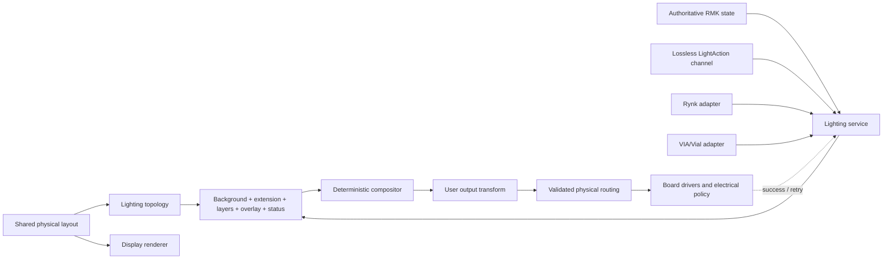

# Lighting system design

RMK lighting is a topology-aware compositor, not an event handler attached to
an LED driver. Events tell the lighting service that keyboard state changed;
the compositor defines how background effects, layers, host overlays, and
status indications coexist in one frame.

## Goals

1. Compose independent background, layer, host, user, and status sources
   without one source erasing another's state.
2. Understand when a light corresponds to a key without assuming that every
   light does, or that every key has exactly one light.
3. Provide sparse, active-stack layer lighting out of the box.
4. Support rectangular, ergonomic, split, underglow, indicator, RGB, RGBW,
   intensity, and binary arrangements without keyboard-specific core logic.
5. Keep rendering deterministic, allocation-free, `no_std`, bounded, and
   dormant when visible output cannot change.
6. Give Rynk the complete native model while retaining bounded VIA/Vial
   compatibility.
7. Share physical key geometry with display and host-layout support instead
   of maintaining subsystem-specific copies.

Lighting does not attempt to standardize every effect, make wiring mutable at
runtime, or require geometry, persistence, Rynk, or Vial for simple boards.

## Architecture



The lighting service is the sole mutable owner. Render sources and protocol
adapters do not write drivers or retain competing copies of live lighting
state.

## Identity, geometry, and routing

Three identities remain separate:

- `KeyPosition { row, col }` identifies a logical matrix key.
- `LedId(u16)` is a stable, board-wide semantic light identity. `LedSlot(u16)`
  is only its dense local frame index.
- `(LightingNodeId, OutputId, physical_index)` identifies a hardware address.

The shared physical layout is the sole authority for key geometry:

```rust,ignore
pub struct PhysicalKey {
    pub matrix: KeyPosition,
    pub center: Point3,       // signed Q8.8 key-pitch units
    pub size: KeySize,        // unsigned Q8.8 key-pitch units
    pub rotation: Rotation,   // clockwise centidegrees
}

pub struct PhysicalLayout<'a> {
    pub keys: &'a [PhysicalKey],
}
```

Lighting adds emitter semantics and hardware routing:

```rust,ignore
pub struct LedMetadata {
    pub id: LedId,
    pub key: Option<KeyPosition>,
    pub position: Option<Point3>,
    pub zones: ZoneSpan,
}

pub struct LightingTopology<'a> {
    pub matrix: MatrixSize,
    pub keys: &'a [KeyPosition],
    pub physical_layout: PhysicalLayout<'a>,
    pub leds: &'a [LedMetadata],
    pub zones: &'a [ZoneMetadata<'a>],
    pub zone_memberships: &'a [ZoneId],
}

pub struct PhysicalRoute {
    pub slot: LedSlot,
    pub node: LightingNodeId,
    pub output: OutputId,
    pub physical_index: u16,
}
```

Logical keys are listed separately from measured geometry so matrix holes can
be represented while geometry remains optional or incremental. Several lights
may reference one key; keyless underglow and indicators use `None`. A light's
effective position is its explicit emitter position, otherwise its associated
key center, otherwise absent. Effects that need coordinates must define their
behavior for lights with no position.

Routing is validated independently of semantic slot order. Stable IDs never
encode chain order or split side. Output metadata declares pixel count,
coverage, node ownership, and binary/intensity/RGB/white/addressable
capabilities; the board driver retains channel encoding, power limits, and bus
timing.

## Composition and scheduling

Sources compose from lower to higher priority with stable call order breaking
ties. The standard engine uses these bands:

1. uniform background;
2. board or external extension;
3. active-layer scenes;
4. transient host overlay; and
5. firmware status.

An opaque contribution replaces the value and wake deadline below it;
transparency reveals the lower source. This makes both visible color and the
next required wake deterministic. RMK provides static, blink, and quantized
breathe effects. External effects participate as ordinary sources and cannot
bypass composition.

Layer scenes are sparse and use `ActiveStack`: active layers compose in key
resolution order, and missing cells fall through to lower active layers and
then the background. Ordinary layer indication therefore requires
configuration, not a custom processor.

The compositor reports whether the transformed frame differs from the last
successfully presented frame and the earliest visible-change deadline. Static
output creates no ticker. A frame is committed only after the driver reports
success; failures retain the pending whole frame and follow explicit driver
retry policy.

## State and concurrency

The service reads authoritative snapshots for active/default layers, lock
indicators, sleep, and other RMK state. Events invalidate rendering but are not
the only copy of state. Resolved `LightAction`s use a dedicated lossless
channel rather than a best-effort event subscription.

Protocol and application commands use a bounded, request-correlated mailbox.
Cancellation cannot deliver an abandoned reply to another caller. Every
mutation is serialized with rendering and output lifecycle changes.

The standard engine owns output enable/brightness, the designated background,
and a bounded TTL overlay. Status and board extension sources are supplied by
the board and compose within the same whole frame.

## Configuration and board ownership

`keyboard.toml` and public Rust constructors produce the same static runtime
model. The existing `[layout].map`/KLE layout is the canonical source of key
geometry; code generation derives the fixed-point `PhysicalLayout` consumed by
firmware instead of introducing a second board-layout definition. `[lighting]`
describes stable emitters, named zones, outputs, routes, background defaults,
and sparse layer scenes.

Build-time validation rejects duplicate or unknown IDs, invalid matrix keys,
bad fixed-point geometry, empty selectors, unknown zones/outputs, duplicate
physical addresses, unintended output holes, unsupported color models, and
invalid effect parameters. Generated tables remain in flash.

Keyboard-specific pins, drivers, measured geometry, routing, safety limits,
and status policy belong in the keyboard firmware repository. RMK owns the
schema, validation, compositor, standard behavior, service, and adapter
interfaces. A Glove80 firmware repository should consume these interfaces
rather than adding Glove80 indexing rules to RMK.

## Display interaction

Display and lighting consume the same generated `PhysicalLayout`. They may
also read the same authoritative keyboard snapshot, but they retain separate
renderers, schedules, buffers, and drivers. Lighting topology is not a display
API, and display support does not need to depend on the lighting feature.

## Rynk and VIA/Vial

Rynk is the native interface. It should expose lighting capabilities,
revisioned and paginated physical/topology/routing readback, authoritative
state, and stable-`LedId` overlay operations. Large overlay replacement uses a
bounded begin/append/commit transaction so it is atomic without requiring a
single oversized HID packet. Abandoned staging expires, commit retries are
idempotent, and runtime mutations use expected revisions to reject stale
read-modify-write operations.

VIA/Vial remains a compatibility adapter rather than being replaced. VIA RGB
Matrix custom values control only the designated standard background:
brightness maps to background value, color to hue/saturation, speed to
background speed, and supported modes to off/solid/breathe. Turning that
background off must not disable layers, overlays, status lights, or driver
safety policy. VIA does not carry RMK topology or geometry.

Both adapters submit commands to the same lighting mailbox. Neither owns a
renderer or writes the driver.

## Split keyboards

Host-facing topology uses board-wide stable `LedId`s. Each lighting node owns
a local dense frame, physical outputs, and routes; a split coordinator maps
board-wide commands to node-local slots. Animation state includes a shared
epoch so independently scheduled halves sample effects in phase. Topology and
state revisions prevent stale commands from being silently applied after a
configuration or synchronization change.

## Required invariants

- One authoritative physical layout; no duplicate key-center tables.
- One mutable lighting owner and one whole-frame presentation path.
- No public or persisted dependence on `LedSlot`, chain index, or split-side
  arithmetic.
- Layer-aware sparse composition works without custom code.
- Successful presentation is the only commit point.
- Static visible output causes neither periodic wakeups nor duplicate writes.
- Protocol errors and output failures leave authoritative state recoverable
  and deterministic.
