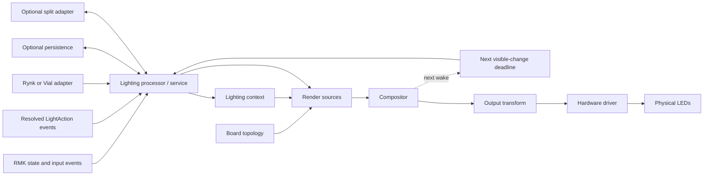
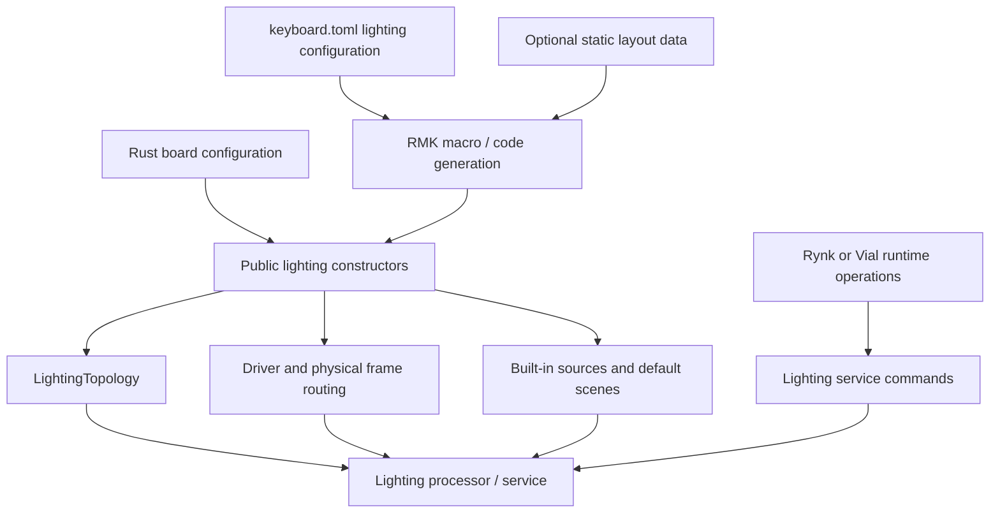

# Lighting system design

> Working design note. This document records goals and boundaries before a
> public API or implementation placement is chosen.

## Problem statement

RMK needs a lighting system that is useful out of the box without turning the
firmware core into a catalog of effects. Keyboard state, animated backgrounds,
layer indications, temporary host output, and firmware status must be able to
contribute to one LED frame without taking ownership away from one another.

The event and processor system answers how lighting observes RMK. It does not
answer how concurrent lighting sources combine, how time-dependent output is
scheduled, or how LEDs relate to keys and physical geometry. Those semantics
belong to the lighting system.

## Goals

1. **Composable.** Independent sources can contribute background, layer,
   user, host, and status lighting without destroying one another's state.
2. **Keyboard-aware without assuming a keyboard shape.** Every LED has a
   stable identity and may optionally be associated with a key, physical
   coordinates, and one or more zones. Multiple LEDs may refer to the same
   key, and LEDs such as underglow or indicators need not refer to a key.
3. **Layer-aware by default.** RMK provides a standard source for sparse
   per-layer lighting with transparent fallthrough. Users should not need to
   write a custom processor for ordinary layer indicators.
4. **Deterministic.** Priority, stable ordering, transparency, animation, and
   conflicts have documented, host-testable results.
5. **Embedded-efficient.** The implementation is `no_std`, allocation-free,
   bounded, and does not wake or write the driver when visible output is
   static and unchanged.
6. **Hardware-independent.** Rendering does not know the LED protocol,
   channel order, current limit, or transport used by a driver.
7. **Host-protocol-independent.** Rynk and Vial adapt to one authoritative
   lighting service; neither protocol defines the renderer's internal model.
8. **Extensible.** External crates can provide effects and render sources
   without replacing RMK's ownership, composition, or scheduling model.
9. **Incremental.** A keyboard can use one static scene and a driver, then add
   geometry, animation, host control, persistence, or split synchronization
   separately.

## Non-goals

- Standardize every RGB effect in RMK core.
- Require every LED to correspond to a key or matrix location.
- Make persistence, host transport, or split transport part of rendering.
- Encode a particular keyboard's current limit, LED count, split layout, or
  status policy as a universal default.
- Require Rynk or Vial in order to use lighting.

## Proposed conceptual model

The design has four boundaries:

1. **Topology** describes LEDs and their optional semantic/physical metadata.
2. **Sources and compositor** produce and combine time-dependent pixels.
3. **Lighting processor/service** owns state, observes RMK, schedules renders,
   and handles commands.
4. **Driver** applies hardware policy and transmits a completed frame.

This mirrors RMK display support's context/renderer/processor/driver split,
with composition and deadline calculation added for lighting.

### Components and runtime flow

The components have deliberately narrow responsibilities:

| Component                           | Responsibility                                                                                          |
| ----------------------------------- | ------------------------------------------------------------------------------------------------------- |
| Topology                            | Stable LED identities plus optional key, coordinate, zone, and physical-output metadata.                |
| Lighting context                    | Current RMK state relevant to sources, including layers and indicators.                                 |
| Render sources                      | Produce sparse or dense time-dependent LED contributions without touching hardware.                     |
| Compositor                          | Apply sources by priority, resolve transparency, and calculate the final frame and next visible change. |
| Lighting processor/service          | Own mutable state, consume events/actions/commands, schedule rendering, and serialize all mutations.    |
| Output transform                    | Apply user brightness or other non-safety color transformations to the completed frame.                 |
| Driver                              | Enforce hardware policy and transmit frames to one or more physical outputs.                            |
| Protocol adapters                   | Translate Rynk or Vial operations into lighting-service commands.                                       |
| Optional persistence/split adapters | Store configuration or transfer authoritative state without becoming rendering dependencies.            |



The processor is the only mutable owner in this diagram. Adapters submit
commands; they do not retain separate live lighting state or write the driver.

### Conceptual Rust interfaces

These sketches describe responsibility and data flow, not final names,
generic parameters, or storage choices.

```rust,ignore
#[derive(Copy, Clone, Eq, PartialEq)]
pub struct LedId(pub u16);

#[derive(Copy, Clone)]
pub struct Point {
    pub x: u16,
    pub y: u16,
}

#[derive(Copy, Clone)]
pub struct LedMetadata {
    pub key: Option<KeyPos>,
    pub position: Option<Point>,
    pub zones: ZoneMask,
}

pub struct LightingTopology<'a> {
    pub leds: &'a [LedMetadata],
}
```

`LedId` indexes the topology and completed frame. `KeyPos`, coordinates, and
zones are lookup metadata; none is required to address a physical LED.

A source receives current state and writes only the LEDs it contributes. A
sample carries its own visible-change deadline, allowing a later opaque source
to replace both the color and wake requirement of the source below it.

```rust,ignore
pub struct RenderInput<'a> {
    pub now_ms: u64,
    pub context: &'a LightingContext,
    pub topology: &'a LightingTopology<'a>,
}

pub struct Sample<C> {
    pub color: C,
    pub next_change_ms: Option<u64>,
}

pub trait LayerWriter<C> {
    fn set(&mut self, led: LedId, sample: Sample<C>);
}

pub trait LightingSource<C> {
    fn render(&mut self, input: &RenderInput<'_>, output: &mut impl LayerWriter<C>);
}
```

The compositor applies sources in priority and stable registration order. A
possible allocation-free calling shape is an explicit render transaction;
the final storage/dispatch design may instead be generated by the RMK macro.

```rust,ignore
let mut render = compositor.begin(now_ms, &mut frame);
render.apply(BACKGROUND, &mut background, &input);
render.apply(LAYER, &mut layer_scenes, &input);
render.apply(OVERLAY, &mut transient_overlay, &input);
render.apply(STATUS, &mut status, &input);
let result = render.finish();

// result.changed: whether the completed frame differs from the last frame
// result.next_wake_ms: earliest visible self-driven change, or None
```

This form avoids requiring heap allocation, dynamic dispatch, or a
heterogeneous runtime source collection. It also makes ordering visible. The
final API should prevent accidentally applying a lower-priority source after a
higher-priority one.

### Topology

Each physical output receives a stable `LedId`. Associated metadata is
optional:

```rust,ignore
struct LedMetadata {
    key: Option<KeyPos>,
    position: Option<Point>,
    zones: ZoneMask,
}
```

This permits:

- one per-key LED per matrix position;
- multiple LEDs associated with one key;
- underglow LEDs with coordinates but no key;
- indicator LEDs with a zone but no key or coordinate; and
- multiple independent chains represented as one logical output or as
  separate processor instances.

The compositor still addresses completed frames by `LedId`. Key and zone
targets should be resolved through topology when configuration is applied,
rather than repeatedly searching the mapping for every frame.

Coordinates should use a device-independent normalized or fixed-point space.
They are required only by spatial effects. Static, per-key, and zone lighting
must work without them.

### Layer state and built-in layer lighting

The RMK-facing context should contain at least:

- the effective/topmost layer;
- the default layer; and
- the complete active-layer set, with an explicitly bounded layer capacity.

The built-in layer source is a collection of sparse scenes keyed by RMK layer.
When its layer is active, a scene contributes its cells at the configured
priority. Transparent or absent cells reveal lower sources.

The first default behavior may render only the effective layer, matching key
resolution. The API must not preclude composing multiple active-layer scenes
in a documented order.

### Composition

Every active source has an explicit priority. Sources compose from lower to
higher priority; insertion order breaks ties. An opaque cell replaces the
cell below and a transparent cell leaves it unchanged.

Useful default priority bands may be provided for background, layer, user
overlay, and status sources, but these are policy defaults rather than distinct
core types. The first version need not provide alpha or additive blending.

The compositor operates on already-active sources. This keeps predicates such
as USB state, battery thresholds, or split connectivity in RMK/application
policy instead of growing a universal condition enum in the renderer.

### Effects and scheduling

RMK should provide a small useful cell-effect set such as static, blink, and
breathe. Each effect must define:

- its color at a caller-provided time; and
- the next time its visible output can differ, or no deadline when static.

External effects may produce a dense frame, such as a spatial PaletteFx
background, or a sparse contribution. They participate as sources and do not
write the hardware driver directly when composition is enabled.

The final render result reports `changed` and `next_wake`. The processor merges
that deadline with incoming events and commands. Fixed-rate polling remains an
available implementation for effects that cannot cheaply predict a deadline,
but static output does not create a ticker.

### Processor and service ownership

One lighting processor instance owns:

- the current RMK lighting context;
- mutable source state;
- the compositor and frame buffers;
- the next render deadline; and
- the driver.

RMK events, `LightAction`s, host commands, and deadlines all enter this owner.
They mutate state and request a render; they do not write LEDs independently.
This is the concurrency boundary that prevents sources from racing or losing
one another's state.

### Driver

The driver receives a completed frame and owns:

- physical channel order and encoding;
- bus timing and asynchronous transfer;
- power sequencing;
- hardware current and brightness safety limits; and
- any device-specific frame-level power budgeting.

No host request or render source can bypass the driver's safety policy.

The driver boundary should resemble RMK's display driver boundary while
accepting a completed color frame:

```rust,ignore
pub trait LightingDriver<C> {
    type Error;

    fn write(
        &mut self,
        frame: &[C],
    ) -> impl Future<Output = Result<(), Self::Error>>;
}
```

Driver construction remains board- and HAL-specific. A driver may represent
one chain or route disjoint frame ranges to several physical outputs.

### Board configuration and layout ownership

Board configuration has two categories that should not be conflated:

- **Physical configuration:** drivers, pins, buses, power control, frame
  routing, LED count, and safety limits. This is compile-time board firmware
  configuration.
- **Logical topology and behavior:** key associations, coordinates, zones,
  built-in sources, priorities, and default scenes. Most of this is also
  compiled by default, while supported behavior settings may later be changed
  through the lighting service.

Both `keyboard.toml` and Rust configuration should construct the same runtime
components:



For `keyboard.toml` users, small layouts may be described inline. Larger
per-LED coordinate and key tables should be allowed in a separate static data
file or generated Rust module so the main keyboard configuration remains
readable. The macro validates at build time that:

- every physical frame slot has exactly one `LedId`;
- every referenced key is inside the configured matrix;
- coordinates and zone identifiers fit their bounded representation;
- scene targets resolve to at least one LED; and
- driver frame ranges do not overlap or leave unintended holes.

Rust-configured keyboards provide the same metadata through static slices or
const constructors and receive the same validation where possible.

Runtime protocols may inspect topology and modify supported behavior, but they
must not change pin assignments, driver routing, LED count, or hardware safety
limits. Whether key associations, coordinates, and zones are mutable is a
separate capability and should default to read-only compiled board data.

#### Example layout shapes

The topology must cover at least these configurations without special core
types:

- a one-color status LED with no key or coordinates;
- a rectangular per-key matrix where each LED maps to one `KeyPos`;
- a non-rectangular ergonomic keyboard whose electrical chain order differs
  from matrix and physical order;
- a keyboard with multiple LEDs for one key;
- mixed per-key and underglow LEDs sharing a driver;
- independent indicator and RGB chains on different drivers; and
- split boards where each half renders a local frame.

For split boards, each firmware half should own a local physical topology and
driver. A higher-level logical topology may assign stable board-wide IDs for
host configuration, but split routing and synchronization translate those IDs
outside the compositor. The core compositor should not contain a left/right
index rule.

### Rynk and Vial

The lighting service is usable without either protocol.

Rynk can expose the full RMK-native model over typed endpoints: capabilities,
topology, active configuration, source selection, and transient overlay
operations. The current `lighting_enabled` capability is an integration point,
not yet a definition of that model.

Vial remains a compatibility adapter. Standard brightness, enable, speed,
hue, and mode operations can control a designated background source when the
configured source supports them. Vial does not need to express every sparse
scene, topology field, or compositor priority in order for the firmware to use
those features.

## Initial implementation boundary

Before adding a host protocol or driver, the first reviewable unit should prove:

- topology can represent key LEDs, non-key LEDs, coordinates, and zones;
- sparse active sources compose by explicit priority and stable order;
- built-in layer scenes respond to a complete layer-state snapshot;
- static/blink/breathe output and exact wake behavior are deterministic;
- caller-owned buffers and capacities remain allocation-free; and
- a dense external effect frame can participate below sparse overlays.

Persistence, split synchronization, Rynk endpoints, Vial commands, and concrete
LED drivers should be separate integrations against this core contract.

## Open design questions

1. Should topology and composition live in RMK, or in a small crate consumed by
   RMK and external effect libraries?
2. What shared RGB/HSV types minimize conversion without coupling the core to
   one effects library?
3. Should multiple active layer scenes compose, or should the built-in source
   initially render only the effective layer?
4. Are named zones configuration data, compile-time identifiers, or a compact
   user-assigned bit mask?
5. Should transient TTL cells be in the first compositor unit or a separate
   source implemented immediately afterward?
6. What capacity parameters give useful control without producing an unusable
   const-generic public type?
7. How should a split keyboard describe one logical topology while each half
   owns and renders a local physical frame?
